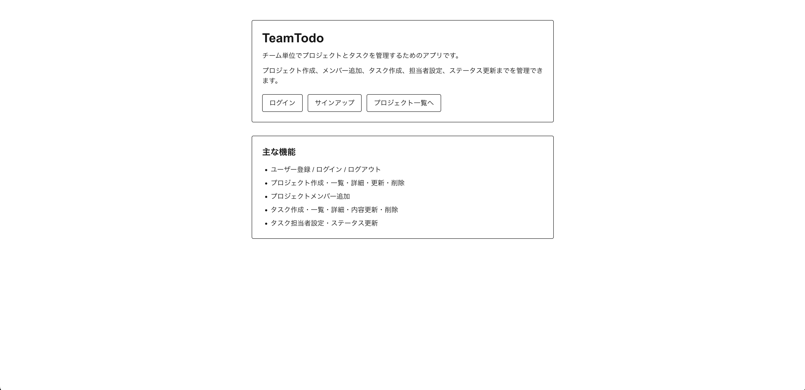
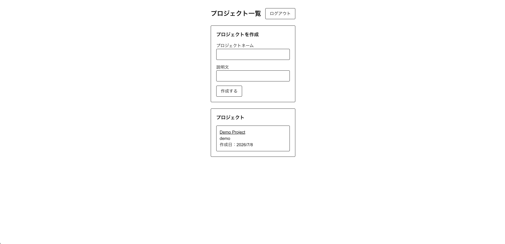
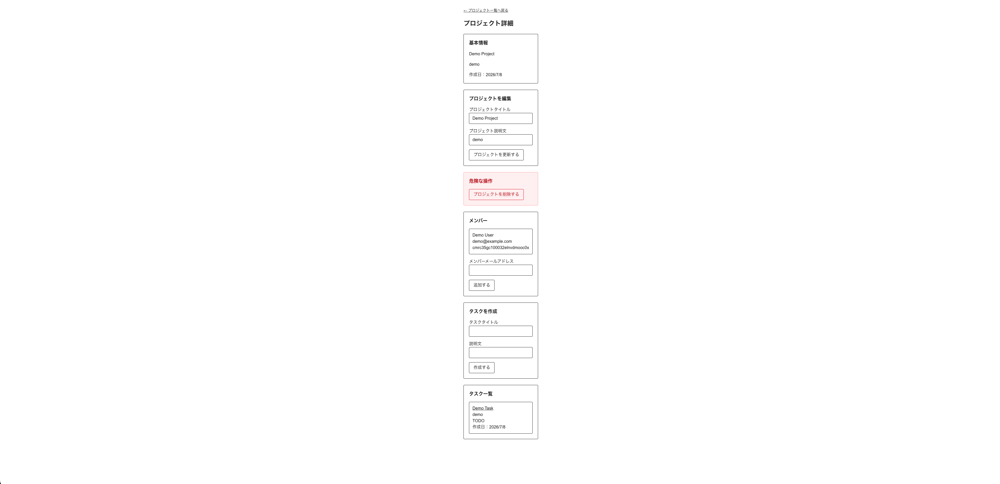
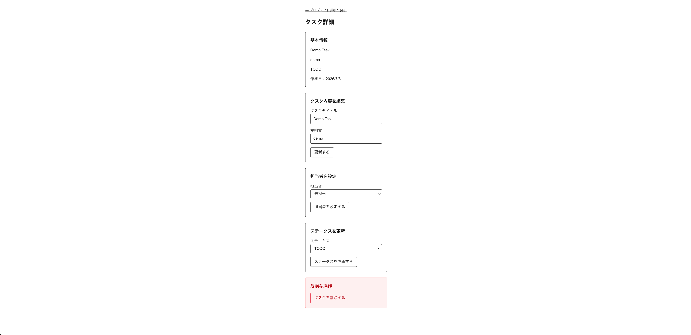
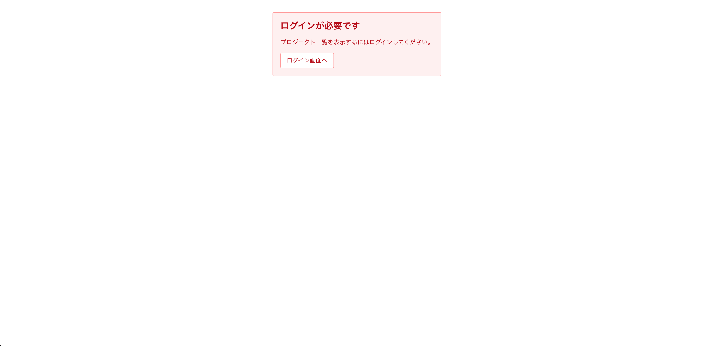

# TeamTodo

TeamTodo は、小規模なプロジェクトチーム向けのタスク管理アプリです。  
プロジェクト単位でメンバーを管理し、タスクの作成・担当者設定・ステータス更新を行える構成を目指しています。

現在は MVP の主要機能を一通り実装し、Render へのデプロイまで完了しています。

## 作成背景

このプロジェクトは、単純な Todo アプリの次のステップとして、より実務に近い構造の Web アプリを設計・実装するために作成しています。

特に以下の力を伸ばすことを目的としています。

- Next.js と Express を分けた構成での Web アプリ開発
- PostgreSQL と Prisma を使ったデータモデリング
- メール / パスワード認証の実装
- セッションベース認証の理解
- プロジェクト、メンバー、タスク間のリレーション設計
- 認証・認可を考慮した API 設計
- 設計から実装、公開準備までの一連の開発プロセスの習得

完成形のサービスというより、学習・設計・実装・公開までの過程を含めたポートフォリオ用プロジェクトとして作成しています。

## アプリ概要

TeamTodo では、ユーザーがログイン後にプロジェクトを作成し、プロジェクトメンバーを追加した上で、タスクの作成・担当者設定・ステータス更新を行えます。

主な操作の流れは以下です。

1. ユーザー登録 / ログイン
2. プロジェクト作成
3. プロジェクトメンバー追加
4. タスク作成
5. タスク担当者設定
6. タスクステータス更新

## 画面イメージ

### トップページ



### プロジェクト一覧



### プロジェクト詳細



### タスク詳細



### 未ログイン時のログイン誘導



## 現在の開発ステータス

現在は MVP の主要機能を一通り実装済みです。

認証、プロジェクト管理、メンバー管理、タスク管理、担当者設定、ステータス更新、認可制御、401 / 403 / 404 の表示確認まで完了しています。
また、Render 上にフロントエンド、バックエンド、PostgreSQL をデプロイし、本番環境での主要操作の通し確認まで完了しています。

- コメント、通知、ファイル添付、招待機能、リアルタイム更新、カンバン表示などは今回の MVP には含めていません。

## 主な機能

### MVPで実装した機能

- ユーザー登録 / ログイン
- プロジェクト作成
- プロジェクト一覧取得
- プロジェクト詳細取得
- プロジェクトメンバー追加
- タスク作成
- タスク一覧取得
- タスク詳細取得
- タスク内容更新
- タスク削除
- タスク担当者設定
- タスクステータス更新

### 今回は実装しない機能

- コメント
- 通知
- ファイル添付
- 招待機能
- 権限ロールの細分化
- リアルタイム更新
- カンバン表示

## 使用技術

### フロントエンド

- Next.js
- TypeScript

### バックエンド

- Node.js
- Express
- TypeScript

### データベース / ORM

- PostgreSQL
- Prisma

### 認証

- メール / パスワード認証
- bcrypt
- express-session
- PostgreSQL セッションストア

### デプロイ

- Render
  - フロントエンド: Render Web Service
  - バックエンド: Render Web Service
  - データベース: Render PostgreSQL

## デプロイURL

- フロントエンド: https://teamtodo-frontend.onrender.com
- バックエンド: https://teamtodo-zhd0.onrender.com

## 設計方針

このアプリでは、単に機能を作るだけでなく、以下を意識して設計しています。

- MVP の範囲を明確にする
- User / Project / ProjectMember / Task の4モデルを中心に構成する
- ProjectMember を中間モデルとして扱い、ユーザーとプロジェクトの多対多関係を表現する
- タスクの担当者は User ではなく ProjectMember を参照する
- プロジェクト作成者とプロジェクトメンバーで操作可能範囲を分ける
- 認証済みユーザーであることだけでなく、プロジェクト内での立場に応じて認可を制御する

## データモデル概要

主なモデルは以下の4つです。

| モデル        | 役割                               |
| ------------- | ---------------------------------- |
| User          | アプリを利用するユーザー           |
| Project       | タスク管理の単位となるプロジェクト |
| ProjectMember | User と Project の中間モデル       |
| Task          | Project に属するタスク             |

主な関係は以下です。

- User と Project は ProjectMember を通じた多対多関係
- Project は複数の Task を持つ
- Task は Project に属する
- Task の担当者は ProjectMember を参照する
- Project は ownerId によって作成者 User を参照する
- Task は createdBy によって作成者 User を参照する

## 認可方針

主な認可方針は以下です。

| 操作                    | 許可するユーザー     |
| ----------------------- | -------------------- |
| プロジェクト作成        | ログイン済みユーザー |
| プロジェクト編集 / 削除 | プロジェクト作成者   |
| メンバー追加            | プロジェクト作成者   |
| タスク作成              | プロジェクト作成者   |
| タスク内容更新          | プロジェクト作成者   |
| タスク削除              | プロジェクト作成者   |
| タスク担当者設定        | プロジェクト作成者   |
| プロジェクト閲覧        | プロジェクトメンバー |
| タスク閲覧              | プロジェクトメンバー |
| タスクステータス更新    | タスク担当者         |

未担当タスクは、誰もステータス更新できない方針にしています。

## API設計

### 認証系

| 機能                   | メソッド | URL       |
| ---------------------- | -------- | --------- |
| 登録                   | POST     | `/signup` |
| ログイン               | POST     | `/login`  |
| ログアウト             | POST     | `/logout` |
| ログイン中ユーザー取得 | GET      | `/me`     |

### プロジェクト系

| 機能         | メソッド | URL                            |
| ------------ | -------- | ------------------------------ |
| 一覧取得     | GET      | `/projects`                    |
| 作成         | POST     | `/projects`                    |
| 詳細取得     | GET      | `/projects/:projectId`         |
| 更新         | PATCH    | `/projects/:projectId`         |
| 削除         | DELETE   | `/projects/:projectId`         |
| メンバー追加 | POST     | `/projects/:projectId/members` |

### タスク系

| 機能           | メソッド | URL                                           |
| -------------- | -------- | --------------------------------------------- |
| 一覧取得       | GET      | `/projects/:projectId/tasks`                  |
| 作成           | POST     | `/projects/:projectId/tasks`                  |
| 詳細取得       | GET      | `/projects/:projectId/tasks/:taskId`          |
| 内容更新       | PATCH    | `/projects/:projectId/tasks/:taskId`          |
| 削除           | DELETE   | `/projects/:projectId/tasks/:taskId`          |
| 担当者設定     | PATCH    | `/projects/:projectId/tasks/:taskId/assignee` |
| ステータス更新 | PATCH    | `/projects/:projectId/tasks/:taskId/status`   |

## 現在の実装状況

現在、以下の順序で実装が完了しています。

- [x] 開発環境のセットアップ
- [x] DB / Prisma モデル定義
- [x] 認証機能
- [x] プロジェクト機能
- [x] メンバー追加機能
- [x] タスク機能
- [x] 担当者設定 / ステータス更新
- [x] 認可・UI調整
- [x] README
- [x] デプロイ準備
- [x] Render デプロイ

## 工夫した点

- セッションベースの認証
- ProjectMember を使った多対多関係
- Task の担当者を User ではなく ProjectMember として扱う設計
- owner / member / assignee による認可制御
- 401 / 403 / 404 の表示分離
- 環境変数を用いた本番環境向け CORS / Cookie 設定
- MVP 範囲を意識した設計

## 設計資料

詳細な設計メモは以下にまとめています。

- [design.md](./design.md)

設計メモには、MVP、画面一覧、モデル設計、認証・認可方針、API案、技術選定理由を記載しています。

## ローカル環境での起動方法

### 前提

このアプリをローカルで起動するには、以下が必要です。

- Node.js
- npm
- Docker

### 環境変数

バックエンドでは `backend/.env.example` をコピーして `backend/.env` を作成します。

```bash
cp backend/.env.example backend/.env
```

フロントエンドでは `frontend/.env.local.example` をコピーして `frontend/.env.local` を作成します。

```bash
cp frontend/.env.local.example frontend/.env.local
```

### データベースの起動

プロジェクトルートで以下を実行し、PostgreSQL を Docker で起動します。

```bash
docker compose up -d
```

### バックエンドのセットアップ

別ターミナルでバックエンドディレクトリへ移動し、依存関係のインストールと Prisma のマイグレーションを実行します。

```bash
cd backend
npm install
npx prisma migrate dev
npm run dev
```

### フロントエンドのセットアップ

別ターミナルでフロントエンドディレクトリへ移動し、依存関係をインストールして Next.js を起動します。

```bash
cd frontend
npm install
npm run dev
```

### アプリの確認

フロントエンドは以下のURLで確認できます。

```text
http://localhost:3000
```

バックエンドは `backend/.env` の設定に従って起動します。

## 注意事項

完成済みのアプリケーションではなく、設計・実装・改善の過程を含めた学習プロジェクトとして公開しています。

機密情報を含む `.env` ファイルは Git 管理対象外にしています。
docker-compose.yml 内の PostgreSQL ユーザー名・パスワードはローカル開発用のダミー値です。本番環境では環境変数で管理する想定です。
