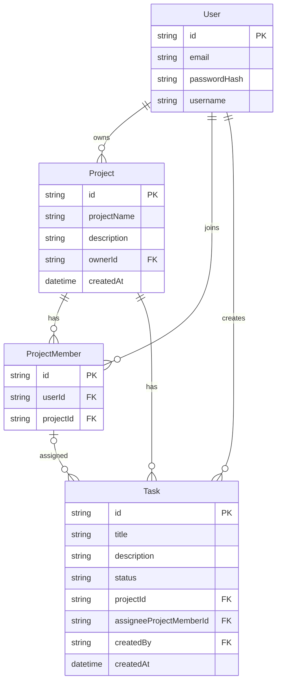

# アプリ設計メモ

## 1. アプリ概要

- アプリ名：TeamTodo
- 一言でいうと：プロジェクト単位でタスクを管理するアプリ
- 誰が使う想定か：社内の小規模なプロジェクトチーム
- このアプリで学びたいこと：モダンなWeb開発における設計・実装・テスト・公開までの一連の流れを実践的に習得すること

## 2. 作る目的

- なぜこのアプリを作るのか：Todoアプリより少し複雑な構造を学ぶため
- Todoアプリの次として、何を伸ばしたいか：設計からデプロイまでの一連の流れ
- このアプリで特に鍛えたい力：アーキテクチャ設計能力

## 3. MVP（最小機能）

### 必ず入れる機能

- ユーザー登録 / ログイン
- プロジェクト作成
- プロジェクト一覧
- メンバー追加機能
- タスク作成
- タスク一覧
- タスク更新
- タスク削除
- ステータス更新（未着手 / 進行中 / 完了）
- タスクの担当者設定

### あれば入れたい機能(優先度順)

- コメント追加

### 今回はやらない機能

- 通知
- ファイル添付
- 招待機能
- 権限ロールの細分化
- リアルタイム更新
- カンバン表示

## 4. 画面一覧

- ログイン画面
- プロジェクト一覧
- プロジェクト詳細 (タスク一覧)
- タスク詳細
- タスク作成 / 編集

## 5. ユーザー操作の流れ

- プロジェクト作成
  1. ログインする
  2. プロジェクトを作成する
  3. プロジェクトメンバーを追加する

- タスク作成
  1. ログインする
  2. プロジェクト詳細画面に遷移する
  3. タスクを作成する
  4. 任意でプロジェクトメンバーからタスク担当者を設定する

- タスク進捗更新
  1. ログインする
  2. プロジェクト詳細画面に遷移する
  3. タスク詳細画面に遷移する
  4. タスクのステータスを更新する

## 6. モデル案

### User

- 役割：アプリを利用するユーザー
- 持たせたい項目：
  - id
  - email
  - passwordHash
  - username

### Project

- 役割：
- 持たせたい項目：
  - id
  - projectName
  - description ※任意
  - ownerId
  - createdAt

### ProjectMember

- 役割：
- 持たせたい項目：
  - id
  - userId
  - projectId

### Task

- 役割：
- 持たせたい項目：
  - id
  - title
  - description ※任意
  - status (未着手/進行中/完了)
  - projectId
  - assigneeProjectMemberId ※任意
  - createdBy
  - createdAt

## 7. モデルの関係

- User と Project (多対多)
  - 1人のUserは複数のProjectに関わることができる
  - 1つのProjectには複数のUserが関わる
  - ProjectMemberを中間モデルとして分解する
- User と ProjectMember (1対多)
  - 1人のUserは複数のProjectMemberを持つ
  - 1つのProjectMemberは1人のUserに属する
- Project と ProjectMember (1対多)
  - 1つのProjectは複数のProjectMemberを持つ
  - 1つのProjectMemberは1つのProjectに属する
- Project と Task (1対多)
  - 1つのProjectは複数のTaskを持つ
  - 1つのTaskは1つのProjectに属する
- ProjectMember と Task (1対多)
  - 1つのProjectMemberが複数のTaskを担当できる
  - 1つのTaskの担当者は0人または1人のProjectMemberとする
  - 未担当の場合、TaskのassigneeProjectMemberIdはnullになる
  - Taskは担当者としてProjectMemberを参照する
- 作成者情報をどこに持つか
  - ProjectがownerIdを持ってUserを参照する
  - Taskの作成者はcreatedByを持ってUserを参照する

## 8. E-R図

※ `Task.assigneeProjectMemberId` は任意項目です。未担当のタスクの場合は `null` になります。

## 9. 認証・認可の方針

### 認証

- ログインは必須
- 認証方法：
  - メール / パスワード方式
  - パスワードはハッシュ化して保存
  - Expressのサーバセッション方式を採用

### 認可

- プロジェクトの作成：ログイン済みなら誰でも
- プロジェクト編集 / 削除：プロジェクト作成者
- プロジェクトメンバー追加：プロジェクト作成者
- タスク作成：プロジェクト作成者
- タスク内容編集：プロジェクト作成者
- タスク削除：プロジェクト作成者
- タスク担当者設定：プロジェクト作成者
- プロジェクト閲覧：プロジェクトメンバー
- タスク閲覧：プロジェクトメンバー
- タスクステータス更新：タスク担当者
- 未担当タスク：誰も更新できない

## 10. API案

### 認証系

| 機能                   | メソッド | URL     |
| ---------------------- | -------- | ------- |
| 登録                   | POST     | /signup |
| ログイン               | POST     | /login  |
| ログアウト             | POST     | /logout |
| ログイン中ユーザー取得 | GET      | /me     |

### プロジェクト系

| 機能             | メソッド | URL                          |
| ---------------- | -------- | ---------------------------- |
| 一覧取得         | GET      | /projects                    |
| 作成             | POST     | /projects                    |
| 詳細取得         | GET      | /projects/:projectId         |
| 更新             | PATCH    | /projects/:projectId         |
| 削除             | DELETE   | /projects/:projectId         |
| メンバー一覧取得 | GET      | /projects/:projectId/members |
| メンバー追加     | POST     | /projects/:projectId/members |

※ メンバー追加は、フロントエンドでは既存ユーザーの email を入力して行う。バックエンド側では、email から User を検索し、見つかった User.id を使って ProjectMember を作成する。

### タスク系

| 機能           | メソッド | URL                                         |
| -------------- | -------- | ------------------------------------------- |
| 一覧取得       | GET      | /projects/:projectId/tasks                  |
| 作成           | POST     | /projects/:projectId/tasks                  |
| 詳細取得       | GET      | /projects/:projectId/tasks/:taskId          |
| 内容更新       | PATCH    | /projects/:projectId/tasks/:taskId          |
| 削除           | DELETE   | /projects/:projectId/tasks/:taskId          |
| 担当者設定     | PATCH    | /projects/:projectId/tasks/:taskId/assignee |
| ステータス更新 | PATCH    | /projects/:projectId/tasks/:taskId/status   |

## 11. 技術スタック案

- フロント：Next.js + TypeScript
- バックエンド：Node.js + Express + TypeScript
- DB：PostgreSQL
- ORM：Prisma
- 認証：メール / パスワード + bcrypt + express-session + PostgreSQL セッションストア
- デプロイ先：Render中心
- 今回その技術を選ぶ理由：
  - フロントはこれまでの学習を継続しつつ、UI実装に集中するため
  - バックエンドは Express を使って API サーバーを別立てで実装し、バックエンド理解を深めるため
  - DB は SQLite ではなく PostgreSQL を使い、本番寄りの構成を学ぶため
  - ORM は Prisma を継続して、DB設計とアプリ実装に集中するため
  - 今回は Express と PostgreSQL を優先し、インフラは重くしすぎないため

## 12. 実装の進め方

### 実装順（予定）

1. 開発環境のセットアップ
2. DB / Prisma モデル定義
3. 認証機能
4. プロジェクト機能
5. メンバー追加機能
6. タスク機能
7. 担当者設定 / ステータス更新
8. 認可・UI調整
9. README / デプロイ準備

<!-- prettier-ignore-start -->

### フロントエンド実装順(予定)

1. API 通信基盤の作成
  - API ベース URL の整理
  - fetch 時に credentials: "include" を付ける
  - 共通 fetch 関数を作るか検討する

2. 認証画面
  - サインアップ画面
  - ログイン画面
  - ログアウト処理
  - /me によるログイン状態の確認

3. プロジェクト画面
  - プロジェクト一覧
  - プロジェクト作成
  - プロジェクト詳細

4. メンバー追加画面
  - MVPでは、既存ユーザーの email を入力して ProjectMember を追加する
  - 招待リンク・ユーザー検索機能は今回実装しない

5. タスク画面
  - タスク一覧
  - タスク詳細
  - タスク作成
  - タスク内容更新
  - タスク削除

6. タスク操作
  - 担当者設定
  - ステータス更新

7. UI / エラー表示の調整
  - ローディング表示
  - バリデーションエラー表示
  - 401 / 403 / 404 の表示

<!-- prettier-ignore-end -->

### フロントエンド実装時に注意すること

- バックエンドは express-session による Cookie セッションを使う
- フロントエンドから認証付き API を呼ぶ場合は credentials: "include" を付ける
- API ベース URL はコードへ直書きせず、環境変数で管理する
  - ローカル開発: http://localhost:4000
  - 本番環境: Render のバックエンド URL
- バックエンド側の CORS は credentials: true を設定する
- CORS の origin は環境ごとに切り替える
  - ローカル開発: http://localhost:3000
  - 本番環境: フロントエンドの本番 URL
- 未ログイン時は 401 を受け取り、ログイン画面へ誘導する
- 権限不足は 403 として扱い、操作不可であることを表示する

### 画面と使用 API の対応

- ログイン画面
  - POST /login
  - GET /me

- サインアップ画面
  - POST /signup

- プロジェクト一覧画面
  - GET /projects
  - POST /projects

- プロジェクト詳細画面
  - GET /projects/:projectId
  - PATCH /projects/:projectId
  - DELETE /projects/:projectId
  - GET /projects/:projectId/tasks
  - POST /projects/:projectId/tasks
  - GET /projects/:projectId/members
  - POST /projects/:projectId/members
    - body: { email }

- タスク詳細画面
  - GET /projects/:projectId/tasks/:taskId
  - PATCH /projects/:projectId/tasks/:taskId
  - DELETE /projects/:projectId/tasks/:taskId
  - PATCH /projects/:projectId/tasks/:taskId/assignee
  - PATCH /projects/:projectId/tasks/:taskId/status

### 先に決めておくこと

- ディレクトリ作成
- 認証の責務分担(フロント / バック)
- API のベース URL は環境変数で管理する
  - ローカル開発: http://localhost:4000
  - 本番環境: Render のバックエンド URL
- メンバー追加 API 入力方式は userId 直接入力ではなく email 入力に変更する
- CORS 方針
  - ローカル開発では http://localhost:3000 を許可する
  - 本番環境ではフロントエンドの本番 URL を許可する
- 環境変数の分け方

## 13. 想定される難所

-
-
-

## 14. 今後の拡張案

-
-
-

## 15. メモ

- 設計中に迷ったこと：
- 後で見直したいこと：
- 実装後に設計を修正したくなった点：
